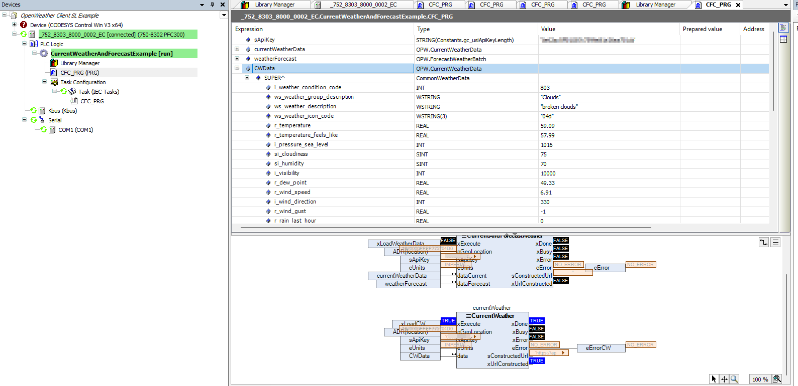
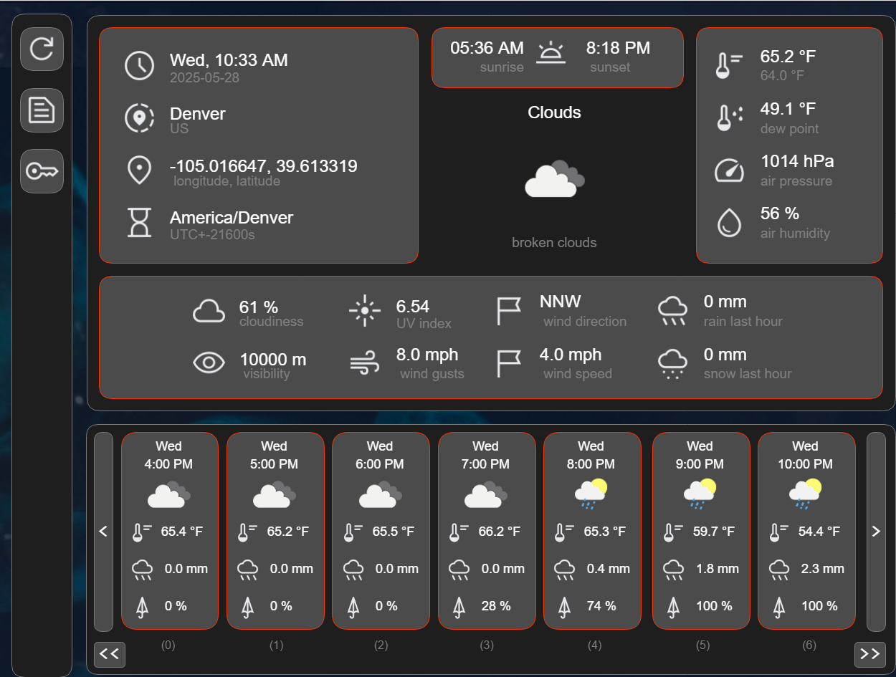

# OpenWeather Client

## Project Details

- [ ] Written in Structured Text 
- [ ] Codesys Version 3.5.19.7
- [ ] Codesys Devices and Libraries 2.0.5.6 
- [ ] Target: WAGO 750-8302 [FW28]
- [ ] CODESYS IIoT Libraries SL 1.12.0.0 or High Required
- [ ] CODESYS Example Project Adapted for WAGO Controllers

## Name
Pull Weather, Forcast and Location Data into CODESYS with OpenWeather API

## Description
This example was created from example Projects from CODESYS provided in the "IIoT Libraries SL Examples" Add-On. 
An API key and Acount is required with [OpenWeather](https://openweathermap.org/). A paid account may be required to use One Call API 3.0 (Tested with sample project). 

{width=1588 height=770}

{width=1250 height=945}
## Support
This program is for demonstration only and does not include support.  May contain bugs.  Use at your own risk.

# Authors and acknowledgment
Dervied from "IIoT Libraries SL Examples" 

Modfied By: 
Mike Psaltis
May 28 2025

## License
This is free and unencumbered software released into the public domain.

Anyone is free to copy, modify, publish, use, compile, sell, or
distribute this software, either in source code form or as a compiled
binary, for any purpose, commercial or non-commercial, and by any
means.

In jurisdictions that recognize copyright laws, the author or authors
of this software dedicate any and all copyright interest in the
software to the public domain. We make this dedication for the benefit
of the public at large and to the detriment of our heirs and
successors. We intend this dedication to be an overt act of
relinquishment in perpetuity of all present and future rights to this
software under copyright law.

THE SOFTWARE IS PROVIDED "AS IS", WITHOUT WARRANTY OF ANY KIND,
EXPRESS OR IMPLIED, INCLUDING BUT NOT LIMITED TO THE WARRANTIES OF
MERCHANTABILITY, FITNESS FOR A PARTICULAR PURPOSE AND NONINFRINGEMENT.
IN NO EVENT SHALL THE AUTHORS BE LIABLE FOR ANY CLAIM, DAMAGES OR
OTHER LIABILITY, WHETHER IN AN ACTION OF CONTRACT, TORT OR OTHERWISE,
ARISING FROM, OUT OF OR IN CONNECTION WITH THE SOFTWARE OR THE USE OR
OTHER DEALINGS IN THE SOFTWARE.